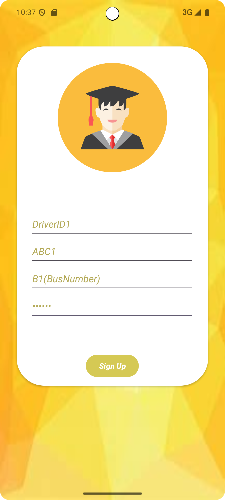
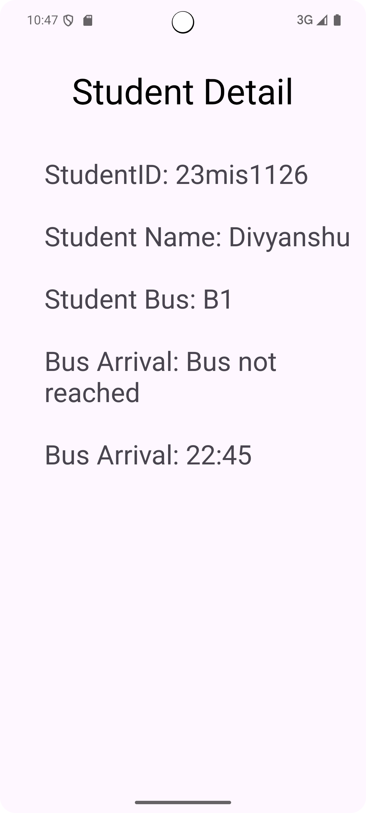

# VBOB - Vehicle Bus On-Board

**VBOB** is an Android application designed for school/college bus tracking. It provides real-time tracking for buses, allowing students to monitor their bus locations and for drivers to manage their routes effectively. The app is integrated with Firebase for user authentication, location tracking, and storing real-time data.

---

## Features

- **Student and Driver Login**: Separate login screens for students and drivers.
- **Real-time Bus Location Tracking**: View live locations of buses.
- **Current Date and Time**: Automatically records and displays the current date and time for bus tracking.
- **Firebase Realtime Database Integration**: Store and retrieve live data from Firebase.
- **Separate Dashboards**: Distinct dashboards for students and drivers to manage their tasks.

---

## Tech Stack

- **Language**: Java (Android SDK)
- **Backend**: Firebase Realtime Database
- **Authentication**: Firebase Authentication
- **Location Services**: FusedLocationProviderClient (for GPS-based location tracking)

---

## Demo Video

A demo video showcasing the features of the VBOB app is included in the `screenshots_and_video/2025-04-18 22-44-09.mkv` folder of this project.
[Link](https://github.com/divyanshujeekota/VBOB_Final/blob/main/screenshots_and_video/2025-04-18%2022-44-09.mkv)

---

## How App is Working

When the driver starts the journey from the first pickup point, they will press the "Start Journey" or "Current Location" button on the app's DriverPage. Then the driver's location starts to get tracked.  
When the driver's location enters the college geofence, the time and date are noted in the Firebase Database, and the registered students of that bus can see the arrival time of the bus on their dashboard.  
With this, students can show the first-hour professor that their bus came late to college, and they can request attendance.

---

## Screenshots

### Starting Screen


---

### Driver SignUp Screen


---

### Driver Login


---

### Student Login


---

### Student Page


---

### Database Structure


---

## Custom Geofence Code

To make a custom geofence, I used the longitude and latitude of VIT Chennai's main gate and adjusted it by +-0.001 to create a squared geofence on the map. If the driver's location (longitude and latitude) falls under this squared geofence, the date and time are stored in the database with details of the bus (e.g., bus number). The location access is then stopped to save the battery on the driver's device.

```java
 private void addGeofence()
    {
        locationCallback = new LocationCallback() {
            @Override
            public void onLocationResult(@NonNull LocationResult locationResult) {
                super.onLocationResult(locationResult);
                if (locationResult == null) {
                    return;
                }
                for (Location location : locationResult.getLocations()) {
                    double latitude = location.getLatitude();
                    double longitude = location.getLongitude();
                    //Custom made geofence based on VIT's main gate longitude and latitude and doing +-0.001 with the it to make a squared fence
                    if (latitude>=12.8394 && latitude<=12.8414 && longitude>=80.1517 && longitude<=80.1537)
                    {
                        Toast.makeText(DriverPage.this, "Reached", Toast.LENGTH_SHORT).show();
                        stopLocationUpdates();
                        storeCurrentDateAndTime();
                    }

                    latTextView.setText("Latitude: " + latitude);
                    lonTextView.setText("Longitude: " + longitude);
                }
            }
        };
    }

 private void startLocationUpdates() {
        if (ContextCompat.checkSelfPermission(this, Manifest.permission.ACCESS_FINE_LOCATION)
                == PackageManager.PERMISSION_GRANTED) {
            fusedLocationClient.requestLocationUpdates(locationRequest, locationCallback, Looper.getMainLooper());
        }
    }

    private void stopLocationUpdates() {
        fusedLocationClient.removeLocationUpdates(locationCallback);
    }

    public void storeCurrentDateAndTime()
    {

        LocalDateTime currentDateTime = LocalDateTime.now();
        DateTimeFormatter dateFormatter = DateTimeFormatter.ofPattern("dd-MM-yyyy");
        String dateString = currentDateTime.format(dateFormatter);


        DateTimeFormatter timeFormatter = DateTimeFormatter.ofPattern("HH:mm");
        String timeString = currentDateTime.format(timeFormatter);
        Toast.makeText(this, dateString+" "+timeString+" "+bus_num, Toast.LENGTH_SHORT).show();
        FirebaseDatabase.getInstance().getReference("Arrival_Detail").child(dateString).child(bus_num).setValue(timeString);

    }
